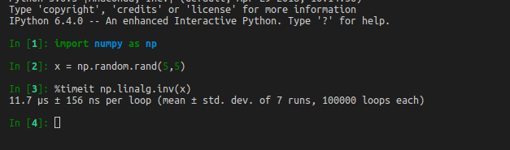
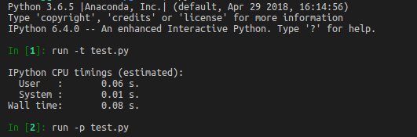
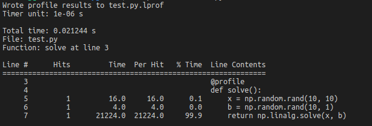

Title: 如何测试python代码
Date: 2018-10-25 13:51
Category: programming
Tags: programing
Author: sjtuzbx
Summary: 怎么profile python代码。

## Profiling Python 

### Timeit

You can use `timeit` in IPython to time the statement.



### Profiler

Say you have following python code:

```python
import numpy as np

def solve():
    x = np.random.rand(10, 10)
    b = np.random.rand(10, 1)
    return np.linalg.solve(x, b)

if __name__ == '__main__':
    solve()
```

You can time the script using following code in ipython:



You can also use `python -m cProfile test.py` to profile.

### Line-profiler

1. Use `pip install line_profiler` to install
2. add `@profile` to decorate your function
3. Use `kernprof -l -v test.py` to profile

```python
import numpy as np

@profile
def solve():
    x = np.random.rand(10, 10)
    b = np.random.rand(10, 1)
    return np.linalg.solve(x, b)

if __name__ == '__main__':
    solve()
```



## Reference

[optimize python code](https://www.scipy-lectures.org/advanced/optimizing/index.html)
[line-profiler](https://github.com/rkern/line_profiler)